<% tp.web.daily_quote() %>

> [!note]+ 新建事项New

<%- tp.user.add_weekly_task(tp.file.title,'#J/ZY  每周四部门周报',4) -%>
<%- tp.user.add_monthly_task(tp.file.title,'#个人  报销、代发工资',-1) -%>
<%- tp.user.add_monthly_task(tp.file.title,'#个人  将做账资料寄给财合税',1) -%>
<%- tp.user.add_birthday_task(tp.file.title,1) -%>

> [!note]+ 瞬时 Fleeting

### 复盘

### 工作流

```mermaid
gantt
    dateFormat HH:mm
	axisFormat %H:%M
	tickInterval 1hour

section 工作

section 家庭

section 个人

section 作息
    起床 : milestone, 06:30, 0m
    晨间日常 : 06:30,2h
    早班 : crit,3.5h
    午间日常 : 90m
    午班 : crit,4.5h
    晚间日常 : 3.5h
    睡觉: milestone, 21:30, 0m
```

